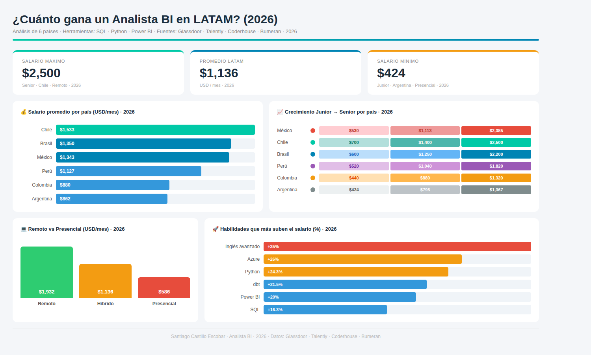

# ¿Cuánto gana un Analista BI en LATAM? (2026)

## Descripción
Análisis completo de salarios para Analistas BI en 6 países de LATAM.

## Herramientas utilizadas
- SQL (MySQL) — modelado y consultas
- Python (Pandas + Matplotlib) — análisis y visualizaciones  
- Power BI — dashboard interactivo

## Insights principales
- Chile paga más en promedio: $1,533 USD/mes
- México tiene el mayor crecimiento Junior → Senior
- Remoto paga 70% más que presencial
- Inglés avanzado sube el salario +35%
- Azure y Python son las habilidades más rentables

## Fuentes
Glassdoor · Talently · Coderhouse · Bumeran · 2026

## Autor
Santiago Castillo Escobar · Analista BI
